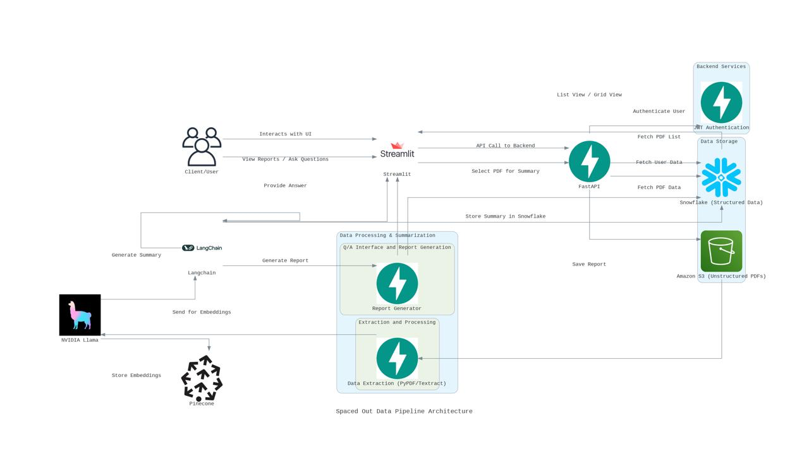

# Assignment 5 - Development of a Structured Database and Text Extraction System for Large-Scale Research Resources

## Project Overview

This project aims to develop a structured database and text extraction system designed to organize and interact with extensive research resources across various domains. By automating data ingestion, processing, and summarization, the system enables users to efficiently explore, query, and extract insights from a wide range of documents. The project is divided into several key components, including data ingestion, automated processing, a client-facing application, research note indexing, and search funct...

---

## Architectural Diagram



The architecture illustrates the data flow and interactions among the key components:
- **NVIDIA Llama and Langchain**: For summary generation and Q&A response generation.
- **Pinecone**: Used for storing embeddings for retrieval-augmented generation (RAG).
- **Streamlit and FastAPI**: Provide the interface and backend services, enabling user interaction with the data.
- **AWS S3 and Snowflake**: Manage both structured and unstructured data storage.
- **JWT Authentication**: Ensures secure user access.

---

## Problem Statement

The project addresses the need for an automated data ingestion and processing pipeline for large-scale research documents, offering an interactive and user-friendly interface to query, summarize, and explore these resources.

---

## Project Goals

1. **Data Ingestion and Automation**: Automate the scraping, ingestion, and storage of large-scale research publications.
2. **Client-Facing Application**: Enable users to explore, summarize, and interact with documents via a secure and accessible web interface.
3. **Incremental Indexing and Search**: Build a flexible, incremental search system for saved research notes, enhancing the retrieval and relevance of information.

---

## Project Tasks

### Part 1: Data Ingestion and Database Population

1. **Data Ingestion**:
   - **Scrape Data**: Extract details such as title, image, summary, and PDF files from the source publications.
   - **Store Data**: Upload images and PDF files to AWS S3 for unstructured storage.
   - **Database Setup**: Create and populate a Snowflake table to store structured data, including links to the content in S3.

2. **Automated Data Processing**:
   - **Airflow Pipelines**: Implement data scraping and uploading to S3 within Airflow.
   - **Database Integration**: Use Airflow to automate the data ingestion process into Snowflake.

### Part 2: Client-Facing Application using FastAPI + Streamlit

1. **FastAPI**:
   - **Document Exploration API**: Develop endpoints for users to explore stored documents.
   - **Grid and Dropdown Selection**: Implement a selection interface in Streamlit, allowing users to pick documents via a grid (image) or dropdown list.
   - **On-the-Fly Summary Generation**: Generate summaries for selected documents dynamically using NVIDIA services.
   - **Multi-Modal RAG**: Integrate multi-modal RAG for querying documents based on user input, leveraging LLAMA and NVIDIA models.
   - **Q/A Interface**: Create an interface for interactive document querying, ensuring efficiency through partial document exchanges.
   - **Report Generation**: Generate responses to user queries in research note format, including links to relevant graphs, tables, and pages.
   - **Validation and Storage**: Manually validate answers for accuracy and save verified responses as "Research Notes."

2. **Streamlit Application**:
   - **Document Selection and Interaction**: Provide an intuitive UI for selecting documents, generating summaries, and interacting through Q&A.
   - **User Experience**: Ensure a seamless and secure user experience.

### Part 3: Research Notes Indexing and Search

1. **Incremental Indexing**:
   - **Multi-Modal RAG Indexing**: Use RAG for incremental indexing of research notes linked to each document.
   - **Hybrid Search Implementation**: Allow document-specific indexing and broader searches based on document IDs.

2. **Search Functionality**:
   - **Note Display**: Show saved research notes when revisiting documents.
   - **Specific vs. Full-Document Search**: Offer search options within research notes or across full documents.
   - **Continuous Learning**: Enable new research notes to update the original index for iterative learning.

3. **Example Queries**:
   - **Topic-Specific Searches**: Examples of search queries to explore trends, comparisons, or historical data.

---

## Deployment

1. **Containerization**:
   - **Docker Compose**: Containerize FastAPI and Streamlit applications for seamless deployment on cloud platforms.
2. **Public Access**:
   - Ensure that both the API and Streamlit application are accessible with clear instructions for users to explore the functionalities.

---

## Running the Application Locally

1. **Clone the Repository**:
   ```bash
   git clone https://github.com/BigDataIA-Fall2024-TeamA5/Assignment3
   ```

2. **Set Up Virtual Environment**:
   ```bash
   python -m venv venv
   ```

3. **Activate the Virtual Environment**:
   - **Windows**:
     ```bash
     venv\Scriptsctivate
     ```
   - **Unix/MacOS**:
     ```bash
     source venv/bin/activate
     ```

4. **Run Docker Compose**:
   ```bash
   cd Assignment5
   make build-up
   ```

5. **Access the Application**:
   - Open a web browser and navigate to `http://34.75.0.13:8000` to access the Streamlit interface.

---

## Application Flow

1. **Homepage**: Users can choose a topic to generate summaries and store them in Pinecone.
2. **Question Generation Page**: Allows users to specify topics and the number of questions, saving the generated questions in Pinecone.
3. **QA Workflow**: Runs a QA process and displays results from the JSON file.
4. **Report Generation**: Creates a visual representation of correct vs. incorrect answers by topic.

---

## Team Contributions

| Team Member          | Contribution (%) | Responsibilities                    |
|----------------------|------------------|-------------------------------------|
| Aniket Patole        | 50%             | Part 2, Part 3                     |
| Saurabh Vyawahare    | 38%             | Part 2, Streamlit                  |
| Shreya Bage          | 12%             | Documentation                      |

---

## Additional Resources

- **Code Labs**: [Link to Code Labs](https://codelabs-preview.appspot.com/?file_id=1xMhQj122aLfxQUHGYq_5EKegDkrTj57cR6MEq0NCTE4#3)
- **Video Demonstration**: [Project Video Link](https://drive.google.com/drive/u/0/folders/1VozeLR1GTBusVJXih_fo1F7lMnY-L-HG)

---

## Conclusion

This project provides a scalable approach to document ingestion, summarization, and question answering using multi-modal retrieval and summarization techniques. The goal is to create a reusable architecture for resource management across sectors with extensive research resources, contributing valuable insights into large-scale knowledge retrieval for various industries.

---
